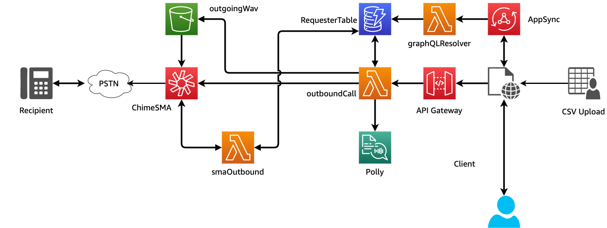
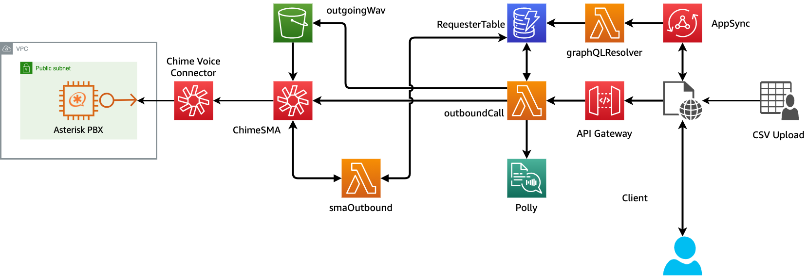
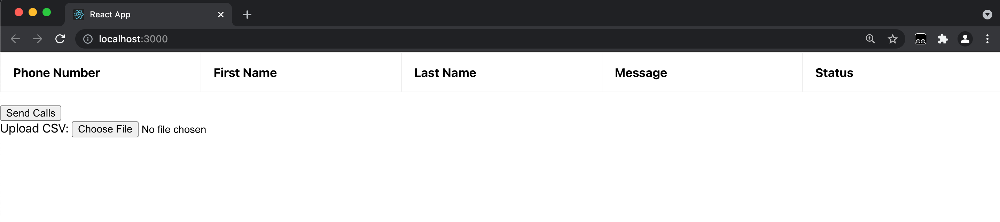
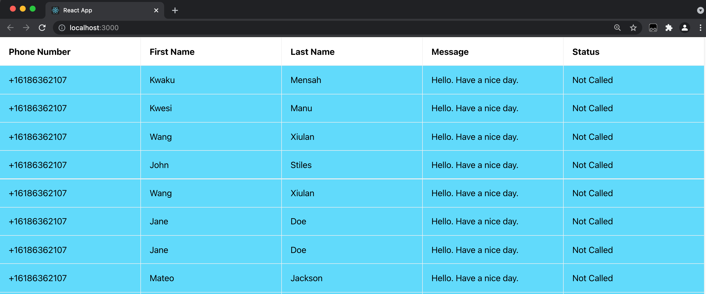
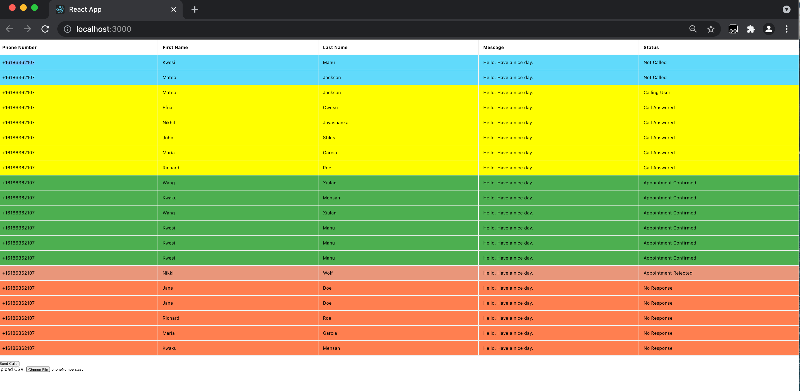

# Outbound Notifications with SIP Media Application

This demo will build and configure several services within AWS so that you can send a meeting reminder with confirmation to a PSTN phone.
## Overview

#### To PSTN

#### With Asterisk

## Requirements
- node V12+/npm [installed](https://www.npmjs.com/get-npm)
- yarn [installed](https://classic.yarnpkg.com/en/docs/install)
- python3/pip [installed](https://packaging.python.org/tutorials/installing-packages/)
- AWS CLI [installed](https://docs.aws.amazon.com/cli/latest/userguide/install-cliv2.html)
- AWS CDK [installed](https://docs.aws.amazon.com/cdk/latest/guide/getting_started.html#getting_started_install)
  - `npm install -g aws-cdk`
  - Be sure to have the latest version installed.  If you need to upgrade, uninstall with `npm uninstall -g aws-cdk` and then reinstall.
- AWS CDK [bootstrapped](https://docs.aws.amazon.com/cdk/latest/guide/bootstrapping.html)
  - `cdk bootstrap`
- Ability to create a Chime SIP media applications and Phone Numbers (ensure your [Service Quota](https://console.aws.amazon.com/servicequotas/home/services/chime/quotas) in us-east-1 for Phone Numbers have not been reached)
- Deployment must be done in us-east-1 or us-west-2 to align with SIP media application resources
  
## Deployment

### Back-end Resources
- Clone this repo: `git clone ENTER_REPO_NAME`
- `cd REPO_NAME`
- `chmod +x deploy.sh`
- `./deploy.sh`
- Accept prompts for CDK deployment
- To deploy with an Asterisk endpoint for automatic call answering `./deploy.sh -o withAsterisk`

### Local client
- `cd client-app`
- `yarn`
- `yarn start`

## Description
This deployment will build everything required to see Amazon Chime SIP media application in action.  A phone number will be provided as part of the CDK output.  This is the number that the call will be made from.  

## Resources Created
- outboundCall - Python Lambda that creates wav files for SMA playback and calls `create_sip_media_application_call` to make outbound calls
- smaOutbound - SMA Lambda that handles processing from SMA
- graphqlResolver - Lambda resolver for graphQL queries and mutations
- outgoingWav Bucket - S3 bucket to store wav files for playing customized messages
- requesterInfo DynamoDB - Table used to store numbers to call and status of those calls
- AppSync API - Used to process DynamoDB Table and handle queries and mutations from Lambdas
- SIP media application - Chime SMA used to make outbound calls.  Associated with smaOutbound Lambda
- (Optional) Asterisk Server on Public VPC.  Used to answer calls and reply with DTMF.  Please note - Asterisk can take ~5 minutes to create and configure during CDK deployment.
- (Optional) Chime Voice Connector with Phone Number associated with Asterisk server.

## Additional Resources
- utils\createWav.py - Python script to create wav files using Polly
- utils\CreateCsv.js - Node script to create csv file with random names to call Asterisk server
- wav_files\\* - wav files uploaded to outgoingWav bucket for use with SMA
  
### Local Client Use

The local client is a React app that allows you to upload a CSV file that contains the following fields: `phoneNumber,message,firstName,lastName`

Once the file is uploaded, it will populate the fields:

This will also upload the fields to a DynamoDB using GraphQL for later processing and updating.  To initiate the notifications, press `Send Calls`.  This will make an axios call to an API Gateway triggering the OutboundCall Lambda.  This Lambda will make calls to the number requested and update the DynanamoDB using GraphQL.  This will update the React app using a subscription to give immediate feedback about the state of the call.  If you are using the Asterisk option for sending calls, please be patient as it can take several minutes to fully deploy and configure the Asterisk.  

## Cleanup

To clean up this demo: `cdk destroy --all`.  Additionally, Chime SIP media applications, rules, voice connectors, and phone numbers should be manually removed in the Chime Console.

